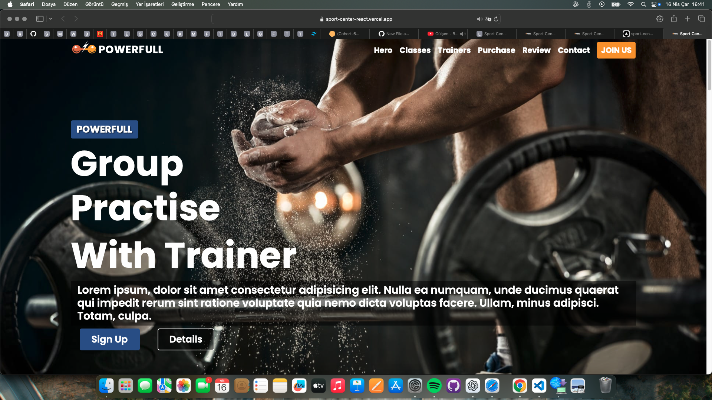

## Ekran Görüntüsü


## Canlı Demo
[SportCenter Uygulaması](sport-center-react-lrdhewhnd-ilayddaas-projects.vercel.app)


# SportCenter React Projesi

Bu proje, spor merkezleri için modern bir web uygulaması geliştirmek amacıyla React kullanılarak oluşturulmuştur.

## Özellikler
- Kullanıcı dostu arayüz
- Dinamik içerik yönetimi
- Mobil uyumlu tasarım
- Hızlı ve performanslı yapı

## Kurulum
1. Bu projeyi klonlayın:
    ```bash
    git clone <proje-linki>
    ```
2. Gerekli bağımlılıkları yükleyin:
    ```bash
    npm install
    ```
3. Uygulamayı başlatın:
    ```bash
    npm start
    ```

## Kullanım
- Projeyi başlattıktan sonra tarayıcınızda `http://localhost:3000` adresine giderek uygulamayı görüntüleyebilirsiniz.


## Katkıda Bulunma
Katkıda bulunmak için lütfen bir pull request gönderin.

## Lisans
Bu proje MIT lisansı ile lisanslanmıştır.